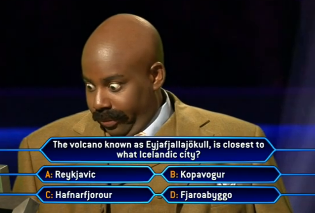

# Tandem's Code Challenge 2020

## A trivia game set to 10 randomized questions provided by Tandem and displayed one by one on the command line for YOU to take a swap at. Your final score will be calculated and displayed at the end of your trivia set. 

### Techstack:
* Python 3 

### Installation:
* Download the .py file and run it directly from your CLI.
* You will be kicked out of the program and will need to restart after 3 failed input attempts.
* Goodluck and have fun learning something new!